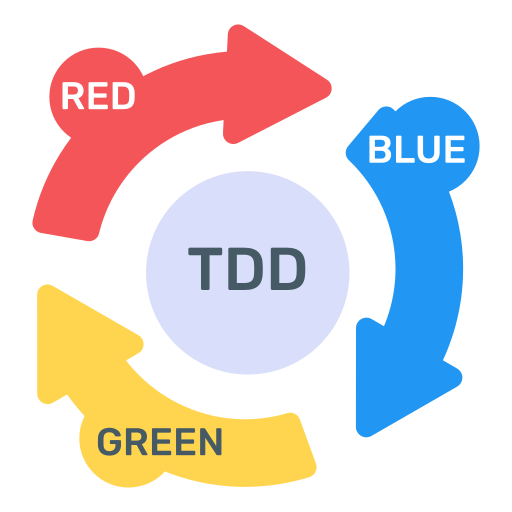
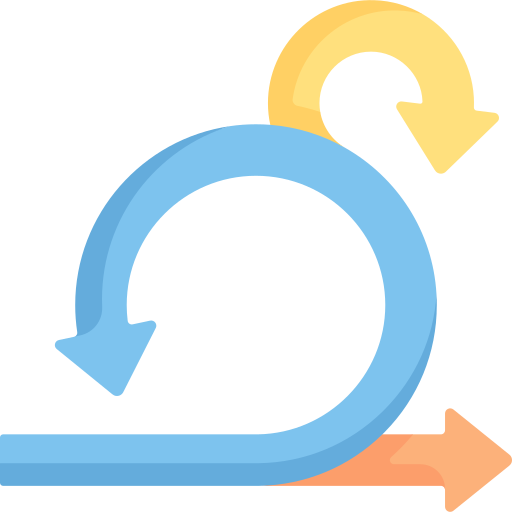

## Hi there 👋

<!--
**vmartowicz/vmartowicz** is a ✨ _special_ ✨ repository because its `README.md` (this file) appears on your GitHub profile.

Here are some ideas to get you started:

- 🔭 I’m currently working on ...
- 🌱 I’m currently learning ...
- 👯 I’m looking to collaborate on ...
- 🤔 I’m looking for help with ...
- 💬 Ask me about ...
- 📫 How to reach me: ...
- 😄 Pronouns: ...
- ⚡ Fun fact: ...
-->

 

 

 

### About

I am a programmer 💻 based in Bordeaux who loves programming and learning. My curiosity and passion for computing and programming began 🚀 when I was very young and continue to grow 🔝 day by day, without stopping.
Currently I'm working as a freelancer.

### Talking about anything:

- 💬 Ask me about anything [here](https://github.com/vmartowicz/vmartowicz/issues/)! 
- 📫 How to reach me: contact@vincent-martowicz.fr

### Skills:

- Languages :
  <code></code>
  <code></code>
  <code></code>
  <code></code>
  <code></code>
  <code></code>
- Backend :
  <code></code>
  <code></code>
  <code></code>
- Frontend :
  <code></code>
  <code></code>
  <code></code>
- Tools :
  <code></code>
  <code></code>
  <code></code>
  <code></code>
  <code></code>
  <code></code>
  <code></code>
  <code></code>
  <code></code>
  <code></code>
  <code></code>
  <code></code>
  <code></code> 
  <code></code>

- CI/CD :
 <code></code>
 <code></code>
 <code></code>
 <code></code> 
- Database : 
  <code></code>
  <code></code>
  <code></code>
  <code></code>  
- Test :
  <code></code>
  <code></code>
  <code></code>
  <code></code>
- Software :
  <code></code>
  <code></code>
- Cloud :
  <code></code>
  <code></code>
  <code></code>
  <code></code>

#### Practices
- <code></code> <code></code> <code></code>

### Some statistics:

|                                                             Languages                                                              | |                                                    Contributions                                                     |
|:----------------------------------------------------------------------------------------------------------------------------------:|:---:|:--------------------------------------------------------------------------------------------------------------------:|
|  |  |  |

